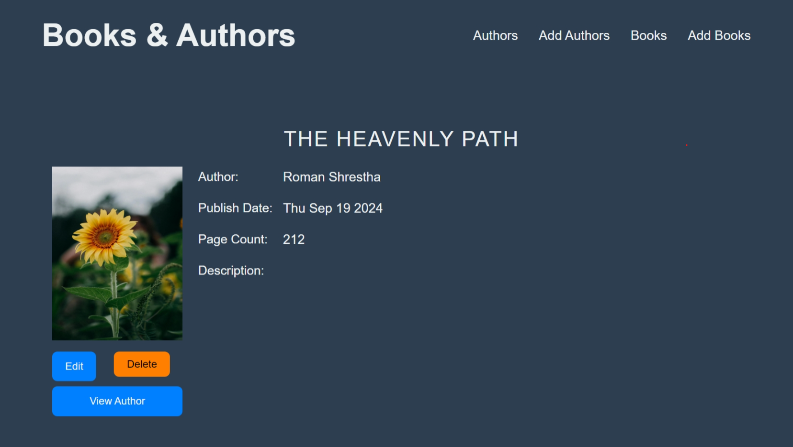

# My Book Library

## Description
My Book Library is a web application that allows users to manage their personal book collections. Users can add, edit, and delete books, as well as search for books in their library.

## Features
- Add new books to the library
- Edit book details
- Delete books from the library
- Search for books by title, author, or genre
- User authentication and authorization

## Installation
1. Clone the repository:
    ```bash
    git clone https://github.com/romanshrestha20/my-book-library.git
    ```
2. Navigate to the project directory:
    ```bash
    cd my-book-library
    ```
3. Install dependencies:
    ```bash
    npm install
    ```

## Usage
1. Start the development server:
    ```bash
    npm start
    ```
2. Open your browser and navigate to `http://localhost:3000`

## Contributing
1. Fork the repository
2. Create a new branch (`git checkout -b feature-branch`)
3. Make your changes
4. Commit your changes (`git commit -m 'Add some feature'`)
5. Push to the branch (`git push origin feature-branch`)
6. Open a pull request

## License
This project is licensed under the MIT License - see the [LICENSE](LICENSE) file for details.

## Acknowledgements
- [React](https://reactjs.org/)
- [Node.js](https://nodejs.org/)
- [Express](https://expressjs.com/)
- [MongoDB](https://www.mongodb.com/)

## Screenshots



## Technologies Used
- React
- Node.js
- Express
- MongoDB

## Contact
For any inquiries, please contact [stha.roman20@gmail.com](mailto:stha.roman20@gmail.com).
